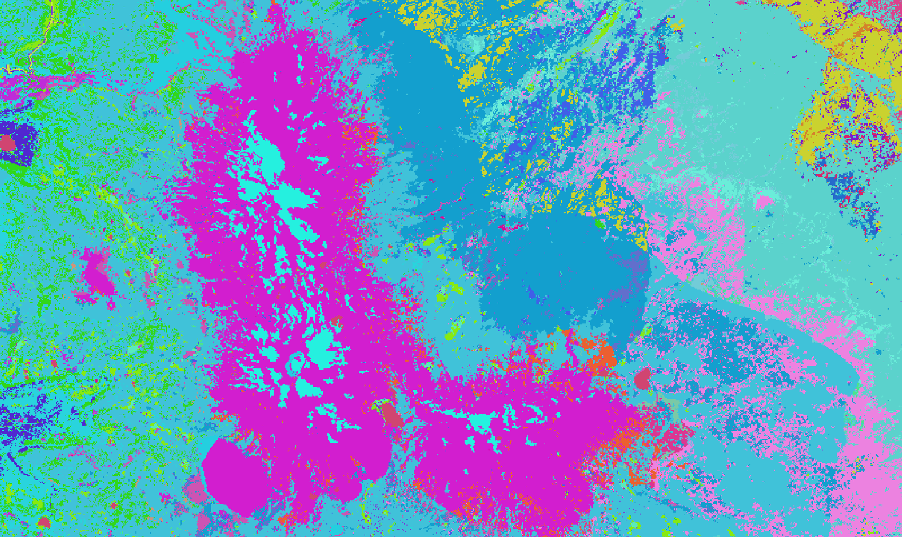
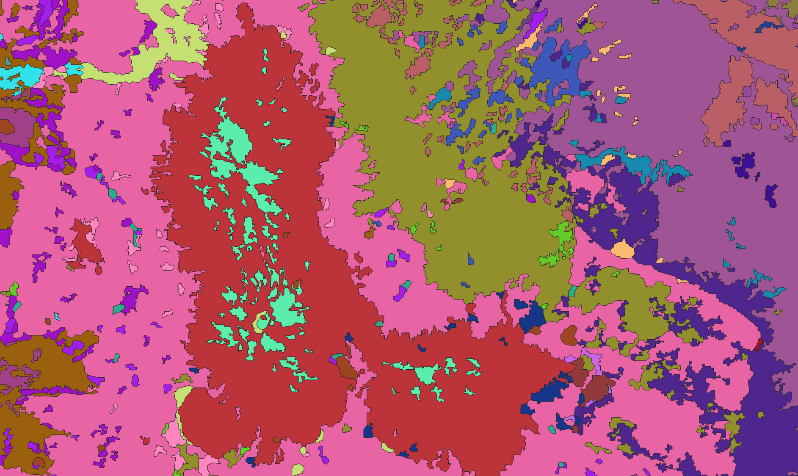

# Geopolygonize

Convert geographic rasters into simplified polygons. Given an input raster file, this tool produces a gpkg file representation of the raster that simplifies out pixelation. It also maintains shapes' relations to one another such that the output is guaranteed to have no gaps.

Here's an example of this in action with an area that shows the Three Sisters in Oregon, near Bend.

Input (rendered in QGIS):



Output (rendered in QGIS):



## Algorithm

Most existing methods for polygon simplification such as the [Douglas–Peucker simplification algorithm](https://en.wikipedia.org/wiki/Ramer%E2%80%93Douglas%E2%80%93Peucker_algorithm) or [concave hulls](http://lin-ear-th-inking.blogspot.com/2022/04/outer-and-inner-concave-polygon-hulls.html) operate on a single polygon at a time. This presents a problem when run on a collection of polygons that fit together perfectly–simplifying each polygon separately will introduce unpredictable gaps. Our algorithm takes an approach similar to [TopoJSON](https://github.com/topojson/topojson). It identifies the boundaries shared between polygons, simplifies those boundaries, then assigns the simplified boundaries back to the polygons. This results in simplified polygons that fit perfectly together without any gaps.

## Install

```
pip install geopolygonize
```

## Quickstart

To convert a raster to simplified polygons, run:

```
geopolygonize --input-file="data/input.tif" --output-file="data/output.shp"
```

## Options + API

Refer to the [docs](https://rainflame.github.io/geopolygonize).

## Development

This package requires the use of Python 3.10 or above.

Install the dependencies:

```
pip install -r requirements.txt
```

Then, run the CLI:

```
python -m src.clean --input-file="data/input.tif" --output-file="data/cleaned.tif"
python -m src.geopolygonize --input-file="data/cleaned.tif" --output-file="data/output.shp"
```

Test against some existing input:

```
./tests/run_e2e_test.sh <input>
```

Find test raster inputs [here](https://drive.google.com/drive/folders/1KiEPwjg9zhowBJEODQTJJ44VPrPkXC3_?usp=drive_link).
