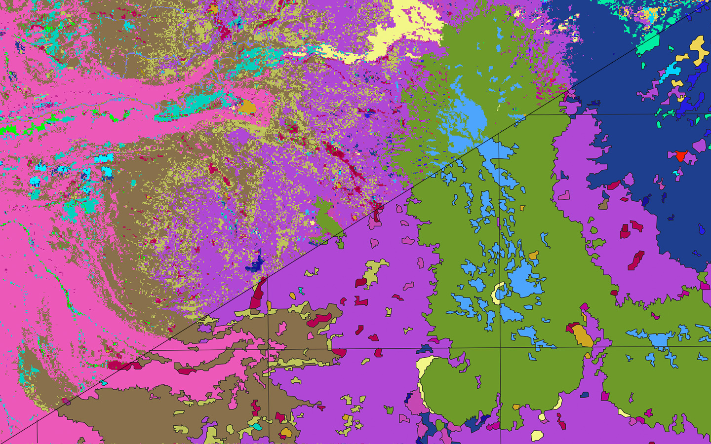

# Landcover tiles



Here we create vector landcover tiles from [USGS Landfire](https://landfire.gov/index.php) landcover classification. These are considerably more detailed than the landcover tiles you'll get from OpenStreetMap or the [National Land Cover Database](https://www.usgs.gov/centers/eros/science/national-land-cover-database). Landfire uses the [U.S. National Vegetation Classification System](https://usnvc.org/), and includes around 1,000 different vegetation classes.

## Download landcover data

Run this script to download raster data from Landfire for a particular bounding box to `data/sources/`:

```
python download_landcover_data.py --bbox="-124.566244,46.864746,-116.463504,41.991794"
```

## Convert raster data to vectors

The raster file represents each vegetation class as a different value in the first band. Each pixel of the Landfire raster dataset is 30 meters, which results in very jagged looking areas when converted to polygons.

We use a novel (to our knowledge, at least) method for converting the rasters into simplified vectors that do not have any clear jagged edges. Most existing methods for polygon simplification such as the [Douglas–Peucker simplification algorithm](https://en.wikipedia.org/wiki/Ramer%E2%80%93Douglas%E2%80%93Peucker_algorithm) or [concave hulls](http://lin-ear-th-inking.blogspot.com/2022/04/outer-and-inner-concave-polygon-hulls.html) operate on a single polygon at a time. This presents a problem when run on a collection of polygons that fit together perfectly–simplifying each polygon separately will introduce unpredictable gaps. Our algorithm takes a different approach. It identifies the boundaries shared between polygons, simplifies those boundaries, then assigns the simplified boundaries back to the polygons. This results in simplified polygons that fit perfectly together without any gaps.

We also perform a cleanup step before converting to vectors that removes any isolated pixels of a particular value. This helps create a more visually cohesive albeit slightly less accurate output. You can specify the minimum size a collection of pixels must be to keep in the raster with `--min-blob-size` in the script below. Collections of pixels below this size will be stripped out and filled in with the pixels around them.

To speed up the computation, we first split the raster into tiles (whose size in pixels can be specified with `--tile-size` in the script), then process the tiles parallel. You can adjust the number of workers that are spawned with `--workers`.

To convert the raster to simplified polygons, run:

```
python clean_and_vectorize_raster.py --input-file="data/sources/*.tif" --output-file="data/output/combined.shp" --tile-size=300
```
